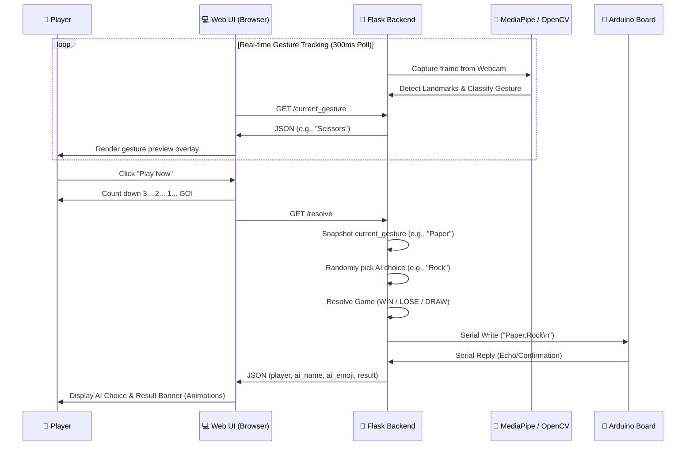

# ✊✌️✋ Rock, Paper, Scissors · AI Vision Game

A premium, interactive web-based Rock, Paper, Scissors game powered by AI computer vision gesture recognition. The application uses your webcam to detect hand gestures in real time (supporting both vertical and horizontal hand orientations) and plays against an AI opponent. In addition, it integrates serial communication to send game results to a connected Arduino board.

---

## 🛠️ Tech Stack

### Backend & AI Vision
* **Python 3.13** & **Flask**: Serves the application, routes, and video feed stream.
* **MediaPipe (Tasks API v0.10+)**: Utilizes the pre-trained `hand_landmarker.task` model to track hand landmarks and determine finger states in real-time.
* **OpenCV**: Handles webcam initialization, image mirroring, RGB conversion, landmark overlay drawing, and frame streaming.
* **PySerial**: Automatically scans available COM ports to detect and communicate with a connected Arduino board at 9600 baud rate.

### Frontend
* **HTML5 & Vanilla CSS3**: A premium, non-scrolling single-page dashboard featuring a dark space theme, glassmorphic card design, custom typography (Outfit font), custom score badges, and smooth keyframe micro-animations (pulse, shake, pop).
* **Vanilla JavaScript**: Polls the Flask backend `/current_gesture` endpoint every 300ms for seamless gesture preview sync, controls the 3-2-1-GO! countdown routine, and requests `/resolve` to snapshot current results.

### Hardware
* **Arduino (C++)**: Listens for game state updates over serial communication and prints the parsed results back.

---

## 🔄 Project Flow

The following diagram illustrates how the system components interact during a typical game cycle:



### Gesture Recognition Logic

1. **Orientation Check**: Compares the wrist landmark (0) to the middle-finger MCP landmark (9) to determine if the hand is held vertically (fingers pointing up) or horizontally (fingers pointing sideways).
2. **Finger Counting**:
   * **Vertical Mode**: Compares finger tips against PIP joints on the Y-axis. The thumb is checked along the X-axis.
   * **Horizontal Mode**: Compares finger tips against PIP joints on the X-axis. The thumb is checked along the Y-axis.
3. **Classification**:
   * **0 fingers open** ➔ **Rock** (✊)
   * **2 fingers open** (Index + Middle) ➔ **Scissors** (✌️)
   * **5 fingers open** ➔ **Paper** (✋)

---

## 🚀 How to Run the Project

### Prerequisites
* **Python 3.13** installed on your system.
* A working **Webcam**.
* (Optional) An **Arduino Board** connected via USB.

### 1. Install Dependencies
You can install the required packages using either standard `pip` or `pipenv`.

**Option A: Using pip**
```bash
pip install -r requirements.txt
```

**Option B: Using Pipenv**
```bash
pipenv install
```

### 2. Prepare the MediaPipe Model
Ensure the MediaPipe model asset `hand_landmarker.task` is located in the root directory of the project. If it is missing, you can download it from the official Google MediaPipe repository:
* Download: [`hand_landmarker.task`](https://storage.googleapis.com/mediapipe-models/hand_landmarker/hand_landmarker/float16/1/hand_landmarker.task)

### 3. Setup the Arduino (Optional)
1. Open the `RPS_Arduino.ino` sketch located inside the `RPS_Arduino` directory in the Arduino IDE.
2. Connect your Arduino board to your computer using a USB cable.
3. Select your board type and COM port in the IDE under **Tools**.
4. Click **Upload** to upload the sketch to your board.
5. Close the Arduino Serial Monitor if it's open, as the Flask app needs exclusive access to the serial port.

### 4. Run the Flask Web Application
Start the Flask development server by running:
```bash
python app.py
```
Alternatively, if using Pipenv:
```bash
pipenv run python app.py
```

The application will start, scan COM ports to detect the Arduino automatically, and be accessible at:
👉 **`http://localhost:5000`**

---

## 🧪 How to Test the Project

### 1. Web UI & Gesture Test
* Open `http://localhost:5000` in a modern web browser.
* Allow webcam access if prompted.
* Position your hand in front of the camera. The video feed will overlay hand skeletal landmarks.
* Verify the live preview pill at the bottom of the video correctly identifies:
  * **Rock**: Fist closed (vertical or horizontal).
  * **Scissors**: Index and middle fingers extended.
  * **Paper**: Hand fully open (vertical or horizontal).
  * **Show your hand...**: When no hand is visible.

### 2. Game Logic Test
* Click the **Play Now** button.
* Position your hand and hold your gesture steady during the `3` ➔ `2` ➔ `1` ➔ `GO!` countdown.
* Once the countdown ends, the AI's choice is revealed with a pop animation, and the result banner shows **You WIN!**, **You LOSE!**, or **DRAW!** according to the standard rules.
* The score counters (WIN, DRAW, LOSE) in the top-right header will update dynamically.

### 3. Arduino Serial Communication Test
* Keep the Flask console/terminal open.
* When a round resolves, you should see logs in the Flask server terminal similar to:
  ```text
  Connected to Arduino on port: COM3
  Sent to Arduino: Paper,Rock
    [Arduino Output]: User Choice is - Paper
    [Arduino Output]: AI is Rock
    [Arduino Output]: --------------------
  ```
* If you see `[Arduino Output]: ...` messages, it confirms that the Flask server successfully sent the choices to the Arduino, and the Arduino successfully read, processed, and replied back over the serial interface.

---

> [!NOTE]
> If you do not have an Arduino connected, the Flask application will run normally without any errors, gracefully ignoring the serial write process.
